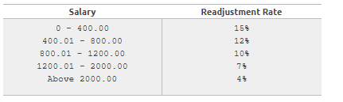

## Salary Increase

### Problem Statement
The company ABC decided to give a salary increase to its employees, according to the following table: 
 
Read the employee's salary, calculate and print the new employee's salary, as well the money earned and the increase percentual obtained by the employee, with corresponding messages in Portuguese, as the below example.

### Input
The input contains only a floating-point number, with 2 digits after the decimal point.

### Output
Print 3 messages followed by the corresponding numbers (see example) informing the new salary, the among of money earned (both must be shown with 2 decimal places) and the percentual obtained by the employee. Note: 
<li>Novo salario:  means "New Salary"</li>
<li>Reajuste ganho: means "Money earned"</li>
<li>Em percentual: means "In percentage"</li>

